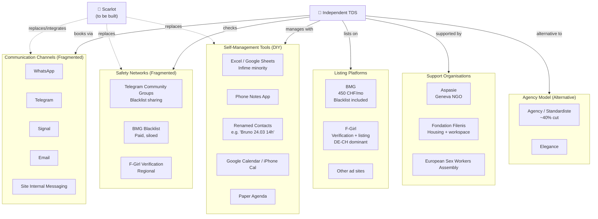
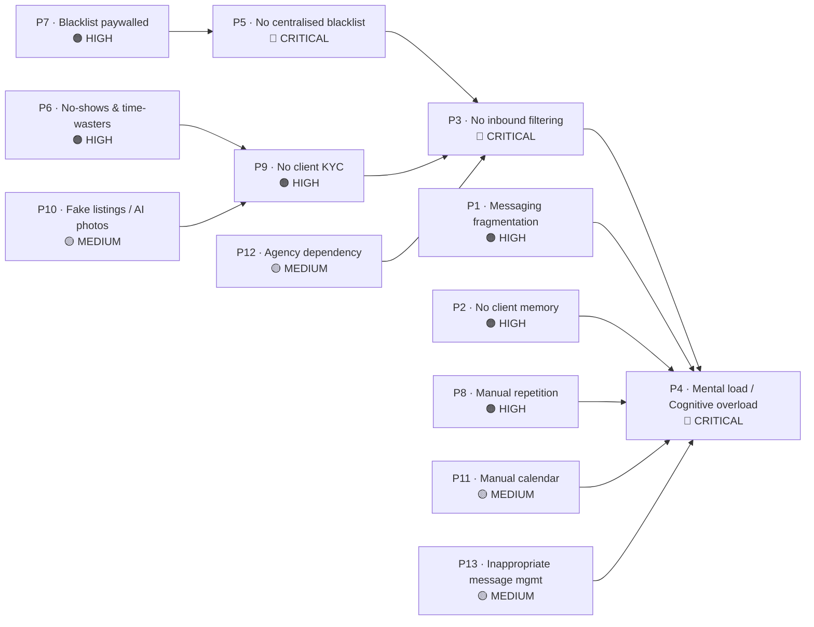
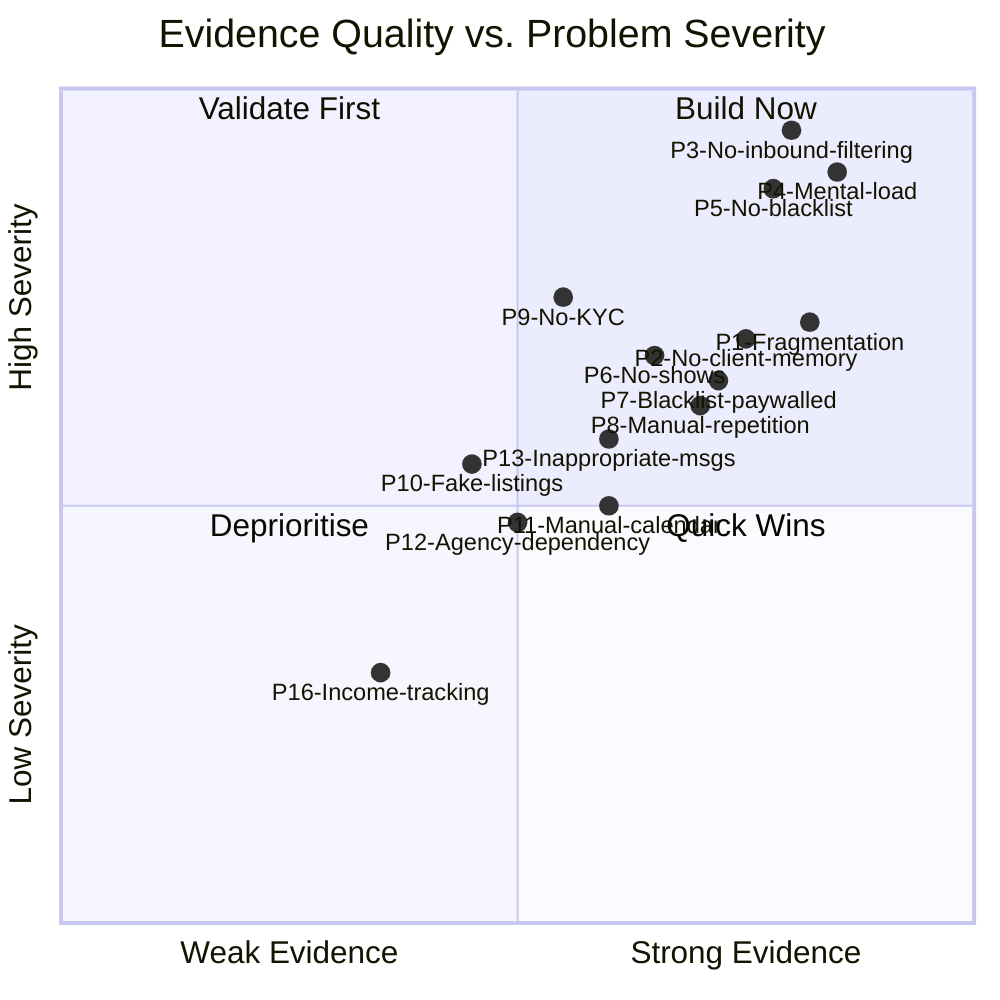
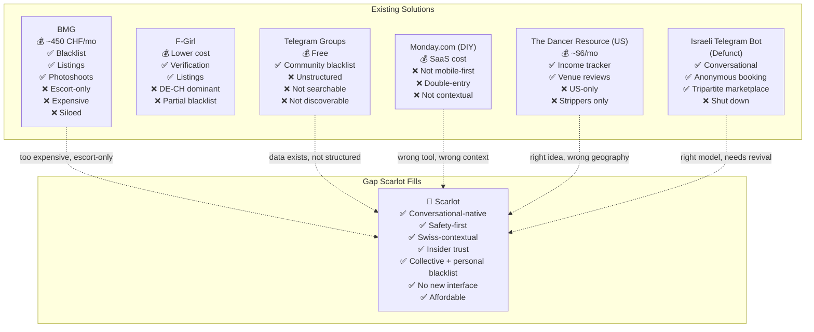
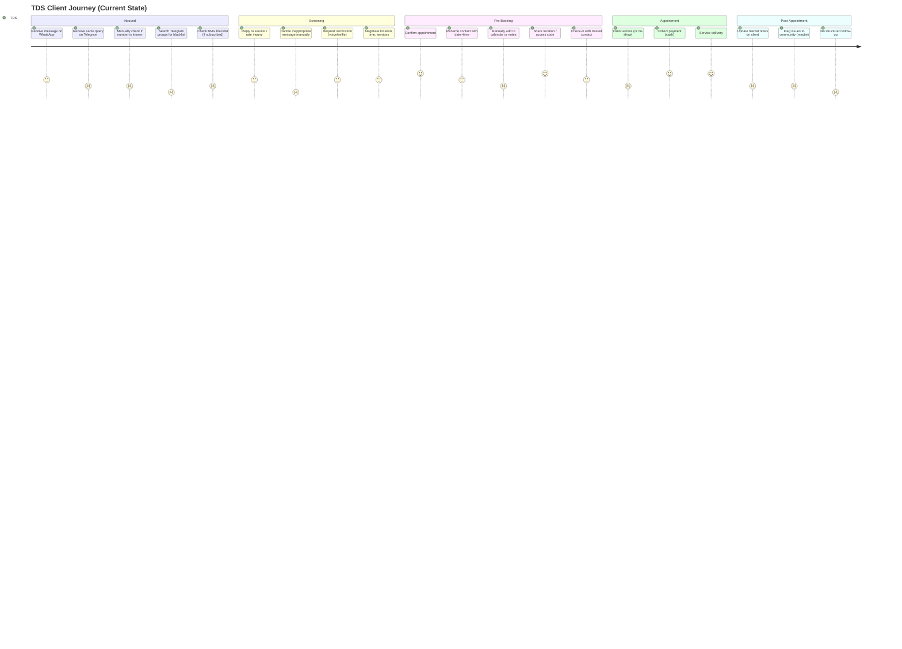
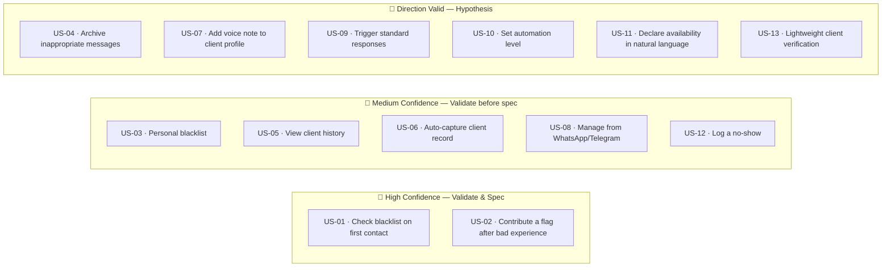

# Scarlot — Discovery Report

## Table of Contents
1. [Executive Summary](#1-executive-summary)
2. [Ecosystem Map](#2-ecosystem-map)
3. [Problem Inventory](#3-problem-inventory)
4. [Concept Catalogue](#4-concept-catalogue)
5. [Evidence Tiers](#5-evidence-tiers)
6. [Competitive Landscape](#6-competitive-landscape)
7. [User Journey Map](#7-user-journey-map)
8. [User Stories](#8-user-stories)
9. [Assumption Log](#9-assumption-log)
10. [Follow-Up Agenda](#10-follow-up-agenda)

---

## 1. Executive Summary

The co-founder is building **Scarlot** — a platform designed to reduce operational friction and improve safety for independent sex workers (TDS — *Travailleurs du Sexe*) in Switzerland. She has deep insider credibility within this community and an existing beta network of ~10 users.

The conversations reveal a market with **genuine, severe, unmet operational needs** — not a solution looking for a problem. The core tension is that TDS operate as solo freelancers managing multi-channel inbound demand with zero tooling built for their context. Every tool they use today was designed for someone else.


**The priority stack, as validated by the co-founder:**

```
1. Safety & filtering (blacklist) ← Most urgent
2. Client information management (CRM) ← Closely coupled with #1
3. Messaging consolidation ← Chronic pain, lower priority than safety
4. Booking / calendar ← Friction exists, not yet prioritized
```

**The vision the advisor introduced** — and the co-founder validated — is a **conversational-native product**: all functionality accessible through existing messaging apps (WhatsApp, Telegram), with no new interface to learn.

---

## 2. Ecosystem Map



---

## 3. Problem Inventory

### 3.1 Problem Frequency Matrix

> Each mention = one distinct reference in the transcripts across all 6 sessions.

| # | Problem | Mentions | Severity | Tags |
|---|---------|----------|----------|------|
| P1 | **Messaging fragmentation** — juggling WhatsApp, Telegram, Signal, site messaging simultaneously | **7** | High | `#ux` `#fragmentation` `#chronophage` |
| P2 | **No client memory** — no persistent record of who a client is, what happened, preferences | **6** | High | `#crm` `#memory` `#context-loss` |
| P3 | **No inbound filtering** — clients have unrestricted access; TDS cannot pre-screen | **6** | Critical | `#safety` `#blacklist` `#asymmetry` |
| P4 | **Mental load / cognitive overload** — constantly switching tools, re-entering data, repeating the same information | **6** | Critical | `#chronophage` `#ux` `#burnout` |
| P5 | **No centralised blacklist** — safety data is scattered across Telegram groups, BMG, F-Girl; not discoverable | **5** | Critical | `#safety` `#blacklist` `#fragmentation` |
| P6 | **Time-wasters & no-shows** — clients negotiate, request info/selfies, confirm, then ghost | **4** | High | `#safety` `#trust` `#no-show` |
| P7 | **Blacklist data is expensive / inaccessible** — BMG charges ~450 CHF/mo; blacklist is paywalled | **4** | High | `#safety` `#access` `#cost` |
| P8 | **Manual repetition** — same information (rates, services, location) typed out for every new client | **4** | High | `#chronophage` `#ux` `#automation` |
| P9 | **No client KYC** — clients are anonymous on arrival; TDS cannot verify identity pre-appointment | **3** | High | `#safety` `#trust` `#identity` |
| P10 | **Bait-and-switch / fake listings** — AI-generated photos making verification increasingly difficult | **3** | Medium | `#trust` `#identity` `#fraud` |
| P11 | **Calendar/booking is entirely manual** — contacts renamed with timestamps, paper agendas, or no system | **3** | Medium | `#booking` `#scheduling` `#ux` |
| P12 | **Agency dependency** — agencies extract 40% and often withhold client identity info | **3** | Medium | `#agency` `#dependency` `#autonomy` |
| P13 | **Inappropriate message management** — no way to archive/flag/dismiss without full block | **3** | Medium | `#safety` `#ux` `#messaging` |
| P14 | **Housing/workspace costs** — dedicated apartments priced to create financial pressure | **2** | Medium | `#financial` `#structural` |
| P15 | **Data siloing between platforms** — activity on BMG invisible to F-Girl and vice versa | **2** | Medium | `#fragmentation` `#interop` |
| P16 | **No income tracking** — cash-based income is hard to record; mentioned via The Dancer Resource comparison | **1** | Low | `#financial` `#tracking` |

---

### 3.2 Problem Relationship Map



---

### 3.3 Problem Statements (Canonical Format)

**PS-01 · Safety / Filtering**
> Independent TDS struggle to filter inbound client contacts before any interaction begins, because all messaging platforms give clients unrestricted access. This forces them to manually process every inappropriate message — block, archive, or respond — resulting in compounding psychological harm and wasted time. Today they solve this by manually blocking contacts after the fact, which is inadequate because it requires prior interaction and offers no collective intelligence about known bad actors.

**PS-02 · Client Memory**
> Independent TDS struggle to maintain a persistent, accessible record of client information across interactions, because data lives in fragmented silos (renamed contacts, WhatsApp history, Telegram threads, notes apps). This results in repeated information requests, lost context, and an inability to personalize or protect themselves based on past behaviour. Today they solve this with renamed phone contacts and occasional Excel sheets — workarounds used by a tiny, educated minority.

**PS-03 · Cognitive Load**
> Independent TDS operating across 3–5 communication channels simultaneously experience chronic cognitive overload, because no tool aggregates communication, scheduling, and client management in one place. This results in time loss, errors, and mental exhaustion that pushes some toward agency dependency (trading 40% revenue for operational simplicity). Today there is no adequate solution — the workarounds are all partial.

---

## 4. Concept Catalogue

Each concept is tagged and linked to the problems it addresses.

---

### C-01 · Shared Blacklist Network
`#safety` `#blacklist` `#collective-intelligence` `#trust`

**What it is**: A shared, searchable database of flagged client phone numbers, contributed by TDS in the community. Each entry carries a risk level, a category (no-show, harassment, non-payment, violence), and a timestamp.

**Why it matters**: The data already exists in Telegram group chats — it's just not structured, not searchable, and not discoverable. Centralising it creates immediate value from day one of adoption.

**Design tensions**:
- Personal blacklist (private) vs. collective (shared) — users should choose
- Anonymity of contributor vs. accountability for false flags
- Access control: who can see, who can contribute

**Linked problems**: P3, P5, P6, P7

---

### C-02 · Conversational Interface (No-UI Paradigm)
`#ux` `#agent` `#whatsapp` `#telegram` `#no-interface`

**What it is**: All product functionality delivered through natural language via existing messaging apps (WhatsApp, Telegram). No new app to install, no new interface to learn. A user sends a voice note or text — the system acts.

**Example interactions**:
- *"I'm off today, cancel everything"* → system marks availability as closed across platforms
- *"Who's this number?"* → system returns blacklist status + prior interaction history
- *"Add this guy to my blacklist — no-show, didn't respond after confirming"* → logged and optionally shared

**Why it matters**: The population already lives in messaging. Learning a new UI is a barrier; a conversational agent removes it entirely.

**Constraint surfaced**: TDS communities actively resist AI *replacing* direct client communication. The agent must assist, not impersonate.

**Linked problems**: P1, P4, P8, P11

---

### C-03 · Client Intelligence Profile (Micro-CRM)
`#crm` `#memory` `#client-profile` `#safety`

**What it is**: A lightweight, auto-populated client record triggered by first contact. Captures: phone number (unique ID), pseudonym, source platform, interaction history, flags, preferences, and notes. Built without manual data entry.

**Minimal V0 fields**:
- Phone number (auto-captured)
- First contact date + source channel
- Risk flag (none / caution / blocked)
- Free-text note (voice or text)
- Blacklist status (personal / collective)

**Why it matters**: The unique identifier — the phone number — is already available at first message. Everything can be built from that anchor without asking TDS to type anything.

**Linked problems**: P2, P6, P9

---

### C-04 · Inbound Message Triage
`#safety` `#automation` `#messaging` `#filter`

**What it is**: Automatic classification of incoming messages before the TDS has to read them. Flags: known blacklisted numbers, repeated harassment patterns, first-contact from new unknown numbers, messages matching inappropriate content signatures.

**User control model** (as discussed):
- **Manual**: TDS sees all, decides all
- **Semi-auto**: System flags and suggests, TDS approves action
- **Auto**: System acts (archive/block/auto-reply), TDS can override

The co-founder explicitly noted: different users will want different control levels.

**Linked problems**: P3, P4, P13

---

### C-05 · Pre-Booking Verification Flow
`#trust` `#identity` `#kyc` `#safety`

**What it is**: A structured verification exchange at the start of a new client interaction. Can include: phone number lookup against blacklist, optional selfie + ID request, location/distance check, service alignment check. Results in a green/amber/red signal before the TDS invests time in negotiation.

**Key insight from transcripts**: Verification expectations vary by user. Some call to hear a voice. Some request a selfie. Some ask for nothing and rely on gut feel. The system should surface intelligence without prescribing the protocol.

**Linked problems**: P6, P9, P10

---

### C-06 · Availability Broadcasting
`#scheduling` `#booking` `#calendar` `#no-interface`

**What it is**: A simple way to declare availability — via text or voice — that propagates to relevant channels without manual updates on each platform. No calendar UI, no grid, no slots to fill in.

**V0 scope**: On/off toggle for availability, shareable link showing current open slots, natural language update ("I'm free Thursday 2pm to 6pm this week").

**Why the complexity is real** (advisor's note on graph theory): Full booking optimization (like OpenTable) requires resource constraint modelling. That's out of scope. V0 is simply: declare → share → confirm.

**Linked problems**: P11, P4

---

### C-07 · Revenue & Income Tracker
`#financial` `#tracking` `#cash`

**What it is**: A lightweight session log that records earnings per appointment — particularly important in a cash-dominant business where income is invisible to tracking systems.

**Inspired by**: The Dancer Resource (US, ~$6/month for strippers) which includes an income tracker.

**Status**: Low priority for V0. Mentioned once. Worth noting as a natural V2 addition.

**Linked problems**: P16

---

## 5. Evidence Tiers



| Tier | Problems | What it means |
|------|----------|---------------|
| 🥇 **Gold** — Build with confidence | P3, P4, P5 | Unprompted, behavioral, emotionally charged, consistent across referenced users |
| 🥈 **Silver** — Build with validation | P1, P2, P6, P7, P8 | Specific and past-tense but via the co-founder's narration, not direct user quotes |
| 🥉 **Bronze** — Hypothesis | P9, P10, P11, P13 | Direction plausible, evidence thin or future-tense |
| ⚪ **Watch list** | P12, P14, P15, P16 | Mentioned, real, but not yet product-scope |

---

## 6. Competitive Landscape



---

## 7. User Journey Map

> Current state — Independent TDS managing a new client interaction end-to-end.



---

## 8. User Stories

> **To the question: can we infer user stories at this point?**
>
> **Yes — with an important caveat.** All evidence is mediated through the co-founder. These stories are *directionally valid* but should be treated as **hypotheses to validate with direct users** before any spec is written. They are written in the voice of the user, not the co-founder.

---

### Epic 1 — Safety & Filtering

**US-01** `#safety` `#blacklist` `#P3` `#P5` 🥇
> As an independent TDS receiving a first message from an unknown number,
> I want to instantly know whether this person has been flagged by other TDS in my network,
> so that I can decide whether to engage before investing any time or sharing any information.

**US-02** `#safety` `#blacklist` `#P5` `#P7` 🥇
> As an independent TDS,
> I want to contribute a flag on a client's number after a negative experience (no-show, harassment, non-payment),
> so that other TDS in my community are protected from the same behaviour without me having to manually warn them in every Telegram group.

**US-03** `#safety` `#personal-blacklist` `#P3` 🥈
> As an independent TDS with specific personal limits,
> I want to maintain a private blacklist that only I can see,
> so that I can remember past negative interactions without being forced to share data I want to keep confidential.

**US-04** `#safety` `#inappropriate-messages` `#P13` 🥉
> As an independent TDS who receives frequent inappropriate messages,
> I want to archive and categorise them without fully blocking the sender,
> so that I have a record of the pattern and can act on it later or share it as evidence.

---

### Epic 2 — Client Intelligence (CRM)

**US-05** `#crm` `#client-memory` `#P2` 🥈
> As an independent TDS interacting with a returning client,
> I want to see a brief summary of our previous interactions — what was agreed, what happened, any notes I left —
> so that I don't have to scroll through WhatsApp history or rely on memory.

**US-06** `#crm` `#auto-capture` `#P2` `#P4` 🥈
> As an independent TDS,
> I want client information to be captured automatically when someone first contacts me,
> so that I never have to manually create a contact record or rename a contact with a timestamp.

**US-07** `#crm` `#notes` `#P2` 🥉
> As an independent TDS after an appointment,
> I want to quickly add a voice note or text note to a client's profile,
> so that I remember relevant details (preferences, behaviour, flags) for next time without typing a form.

---

### Epic 3 — Messaging & Interface

**US-08** `#ux` `#no-interface` `#P1` `#P4` 🥈
> As an independent TDS who already lives in WhatsApp and Telegram,
> I want to manage my availability, client records, and safety checks from within those apps,
> so that I don't have to learn a new tool or switch between applications constantly.

**US-09** `#messaging` `#automation` `#P8` 🥉
> As an independent TDS who answers the same questions repeatedly,
> I want to save standard responses (rates, services, location) that I can trigger quickly,
> so that I reduce the time spent on routine first-contact exchanges.

**US-10** `#messaging` `#control` `#P3` 🥉
> As an independent TDS who values control over my communication,
> I want to define what level of automation I'm comfortable with — from fully manual to semi-assisted —
> so that I never feel like a system is speaking on my behalf without my knowledge.

---

### Epic 4 — Booking & Scheduling

**US-11** `#scheduling` `#availability` `#P11` 🥉
> As an independent TDS,
> I want to declare my availability in natural language ("I'm free Thursday afternoon"),
> so that I can share it with clients without manually managing a calendar interface.

**US-12** `#scheduling` `#no-show` `#P6` 🥈
> As an independent TDS who has experienced no-shows,
> I want to log a no-show against a client's number with one tap,
> so that the pattern is recorded and can inform my decision if they contact me again.

---

### Epic 5 — Trust & Verification

**US-13** `#trust` `#kyc` `#P9` 🥉
> As an independent TDS about to confirm an appointment with a new client,
> I want a lightweight signal that this person is who they say they are,
> so that I can make an informed decision before sharing my address or access code.

---

### User Story Confidence Map



---

## 9. Assumption Log

| ID | Assumption | What breaks if wrong | Status | Cheapest test |
|----|------------|----------------------|--------|---------------|
| A1 | TDS will contribute client data to a collective blacklist | Core network value prop collapses | ❓ Unvalidated | Propose a shared Google Sheet to 5 beta users; measure contribution rate in 2 weeks |
| A2 | The phone number is a stable, sufficient unique client identifier | CRM and blacklist become unreliable | ⚠️ Partially validated | Clients already identified by number in community groups — but number spoofing is a risk |
| A3 | The co-founder's insider trust transfers to the Scarlot platform | Adoption fails in a community that fears exploitation | ⚠️ Partially validated | Aspasie relationship + ESWA contact provides signal; needs direct user confirmation |
| A4 | A conversational/no-UI product is preferred over a dedicated app | Build complexity with no UX advantage | ❓ Unvalidated | Advisor's hypothesis; co-founder resonated but no direct user evidence |
| A5 | The 10 beta users represent the broader independent TDS population in CH | Learning is biased; product misses the real market | ❓ Unvalidated | Map beta user profiles: experience, channels used, income range, nationality |
| A6 | TDS are willing to KYC themselves on a new platform | Verification and trust features fail at onboarding | ⚠️ Partially validated | BMG and F-Girl already require it; but trust in Scarlot ≠ trust in established platforms |
| A7 | AI-assisted triage is acceptable if TDS retain control | Rejection by the community; adoption blocked | ⚠️ Partially validated | Co-founder confirmed community resistance to AI replacing human interaction; semi-auto model needed |
| A8 | WTP exists at meaningful levels (~10% of revenue as cited) | Business model is non-viable | ❓ Unvalidated | No commitment signal captured; forward-looking statement only |
| A9 | Collective blacklist data can be shared without legal / defamation exposure | Legal liability kills the feature | ❌ Not explored | Requires legal counsel before any collective data feature is built |
| A10 | Swiss regulatory context supports this product without special licensing | Regulatory surprise post-launch | ❌ Not explored | Research Swiss data protection (nFADP), defamation law, and sex work regulations |

---

## 10. Follow-Up Agenda

### 10.1 Clarifications Needed from the Co-founder

| # | Question | Why it matters |
|---|----------|----------------|
| Q1 | What exactly is BMG? (platform name, scope, owner) | Competitive understanding; the co-founder mentioned knowing a contact at BMG — potential partner or competitor to profile |
| Q2 | What is Aspasie's formal relationship with Scarlot? | Trust transfer + distribution channel |
| Q3 | What is Fondation Filenis? Does it give Scarlot a physical community touchpoint? | Potential beta user recruitment channel |
| Q4 | What is F-Girl exactly and why does it work in DE-CH but not FR-CH? | Informs why fragmentation exists and what Scarlot's geographic rollout strategy should be |
| Q5 | Has The Dancer Resource been audited as a product benchmark? | Closest existing comparable; $6/mo pricing anchor |
| Q6 | What happened to the Israeli Telegram bot? (shutdown reason, legal issue?) | Closest existing model to the conversational-native vision |
| Q7 | Who is the bizdev-oriented beta user? Can the advisor interview her directly? | Richest anecdotal source in the transcripts — primary interview candidate |

---

### 10.2 User Research Required (Pre-Build)

> These are the actions that must happen before any spec or code is written.

**Priority 1 — Direct user interviews (Mom Test protocol)**

Target: 3 direct 1:1 conversations with beta users, without the co-founder present.

Sample questions (past-behaviour only):
- *"Tell me about the last time you received a message that made you uncomfortable. What did you do, step by step?"*
- *"Walk me through the last time a client didn't show up. What happened after?"*
- *"Show me how you keep track of clients right now. Can you walk me through it on your phone?"*
- *"How much time did you spend last week on messaging and admin? Can we estimate it together?"*

**Priority 2 — Tool inventory per beta user**

For each of the ~10 beta users, map:
- Which messaging apps, and which is primary
- Phone OS (iOS vs Android) — affects Telegram mini-app feasibility
- What (if anything) they use for scheduling
- What (if anything) they use for client notes
- Whether they are on BMG, F-Girl, or other platforms

**Priority 3 — Collective blacklist smoke test**

Before building: create a shared, private Google Sheet. Invite 5 beta users. Ask them to add flagged numbers over 2 weeks. Measure:
- How many numbers were added
- Whether they checked it proactively before responding to new contacts
- What friction arose in the process

---

### 10.3 Open Product Questions

| # | Question | Needed for |
|---|----------|------------|
| PQ1 | Personal blacklist first, or collective from day one? | MVP scope |
| PQ2 | WhatsApp Business API or Telegram mini-app as the integration layer? | Technical architecture |
| PQ3 | Should the system work without any existing platform integration (i.e. standalone)? | MVP scope |
| PQ4 | What is the right level of AI involvement in triage given community sensitivity? | Product positioning |
| PQ5 | How does the collective blacklist handle disputes / false flags? | Trust and safety design |
| PQ6 | What data can legally be stored and shared under Swiss nFADP? | Legal architecture |
| PQ7 | Is B2B (agencies like Elegance) in or out of scope for V1? | Market strategy |

---

### 10.4 POC Definition (Advisor's Proposed Next Step)

The advisor proposed building a limited POC independently using AI-assisted coding tools to test functional direction and user interaction without committing to full architecture.

**Suggested POC scope:**
1. A WhatsApp or Telegram bot that receives a phone number and returns a blacklist status (from a manually maintained list)
2. A simple form or voice note → client record creation flow
3. No shared data in V0 — personal only, to avoid legal and trust complexity

**Success criteria for POC:**
- At least 3 beta users try it organically (not just because the co-founder asked them)
- At least 1 user contributes a blacklist entry unprompted
- At least 1 user checks the blacklist before responding to a new contact

---

*Report compiled from 6 recorded conversation transcripts, February 2025.*  
*All evidence is mediated through the co-founder's narration. Direct user interviews remain the critical next step before any product specification is written.*
